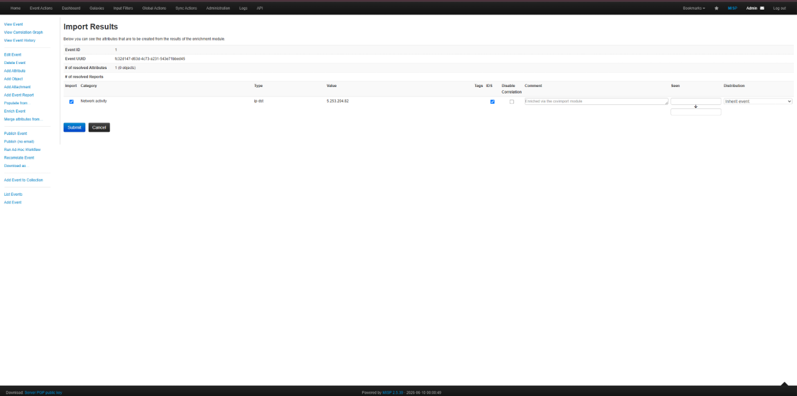

# Contribution 1: Bug: Populate from CSV Import not parsing Tags correctly

**Contribution Number:** 1  
**Student:** Minh Nguyen  
**Issue:** https://github.com/MISP/MISP/issues/9238  
**Status:** Phase III Complete  

---

## Why I Chose This Issue

I selected this issue because it targets an engineering flaw at the ingestion boundary of an enterprise-level threat intelligence platform. In Security Operations Centers (SOC) and incident response automation pipelines, tags act as the primary classification mechanism for indicators of compromise (IoCs). They define Traffic Light Protocol (TLP) sharing boundaries, threat actor taxonomy mappings (such as MITRE ATT&CK matrix vectors), and severity levels. 

When bulk threat intelligence is processed via raw CSV stream ingestion, dropping or misinterpreting tag configurations silently neutralizes downstream alerting loops. This causes intelligence degradation and exposes defensive infrastructure to classification bypasses. Resolving this requires implementing robust input parsing and validation rules inside a multi-language integration ecosystem.

---

## Understanding the Issue

### Problem Description
When utilizing the csvimport utility inside the event population dashboard, the system parses structural fields (like attributes and values) successfully, but strips or ignores the attribute_tag arrays. The components fail to pass the tag elements into the backend processing loop, causing classification objects to emerge completely empty within the persistent database layer.

### Expected Behavior
The ingestion loop must map and capture incoming attribute_tag entries safely, routing them through a verification sequence to confirm they match valid platform taxonomies before assigning them back to the active Event data matrix.

### Current Behavior
The private method handles array assignment for incoming fields (type, category, to_ids, value, distribution, sharing_group_id), but contains no instructions to parse, extract, or hold the attribute_tag metadata payload. It strips it implicitly by omission before returning the filtered payload array.

### Affected Components
Unlike high-level routing components, the failure resides specifically inside the Model layer of the MVC framework, where the data object is built prior to persistence.
* **Target File Path:** MISP/app/Model/Event.php
* **Target Execution Block:** private function __fillAttribute($attribute, $defaultDistribution)
* **Target Lines:** 5676 to 5703

---

## Reproduction Process

### Environment Setup
* **Base Infrastructure:** Handled via a local Docker Desktop container instance running on a Windows 10 host node, using the official misp-docker deployment orchestration template.
* **Volume Mapping Configuration:** Bound the local git fork development directory via docker-compose.override.yml directly into the container execution space using relative directory paths: `./app/Model:/var/www/MISP/app/Model`
* **Subsystem Configuration Overrides:** Bypassed framework caching limits by executing the CakePHP administrative console directly inside the active container to flip module discovery flags:
  * docker-compose exec misp-core /var/www/MISP/app/Console/cake Admin setSetting "Plugin.Import_csvimport_enabled" true
  * docker-compose exec --user www-data misp-core /var/www/MISP/app/Console/cake Admin runUpdates
* **Permission Mitigations:** Mitigated webserver configuration isolation conflicts by forcing directory-level ownership revisions back to the active daemon runtime account:
  * docker-compose exec misp-core chown -R www-data:www-data /var/www/MISP/app/Config
  * docker-compose exec misp-core chmod -R 755 /var/www/MISP/app/Config

### Steps to Reproduce
1. Authenticate to the local administrative dashboard at https://localhost using the platform credentials (admin@admin.test / admin).
2. Navigate to Event Actions -> Add Tag and provision a standard ad-hoc destination validation tag named M247.
3. Select Event Actions -> Add Event to initialize a blank testing event envelope.
4. From the left-hand context menu inside the new event view, select Populate from... -> csvimport.
5. Check the has_header box.
6. Upload a text payload matching this data format schema:
   type,value,attribute_tag
   ip-dst,5.253.204.82,M247
7. Review the intermediate parse review grid before submission.

* **Observed Result:** The parsing routine successfully extracts type (ip-dst) and value (5.253.204.82) but strips the tag completely; the preview table's Tags field remains empty. Clicking submit inserts the indicator into the event workspace with no classifications attached.

### Reproduction Evidence
* **Commit showing reproduction:** https://github.com/Doemin04/MISP/commit/78ef6c1a82e9c4f22879e3f32f60f5857aac0e82
* **Screenshots/logs:** Ingestion preview matrix displays blank arrays under the classification columns despite matching an active database tag.
  
  
* **My findings:** The csvimport python-extension component streams the data column safely over Tornado sockets into the web container. The data drops explicitly inside the core PHP model array filtering method because the system has no code block to listen for the incoming attribute_tag key.

---

## Solution Approach

### Analysis
The root cause is located inside the private data utility handler __fillAttribute. While filtering incoming fields from raw streams, the array manipulation routine isolates explicit parameters but contains no logical instructions to read, extract, or hold the attribute_tag field string.

### Proposed Solution
Modify __fillAttribute to intercept the incoming attribute_tag key string if present. The code will perform a string-splitting split on commas to separate multi-tag payloads, sanitize the tokens, and map them directly into a structured sub-array signature ($attribute['Tag']) that matches the schema structure expected by the backend persistence layer.

### Implementation Plan

Using UMPIRE framework (adapted):
* **Understand:** Ingestion streams using the secondary module layer completely drop tag metadata fields during array filtering normalization inside the Event Model layer.
* **Match:** Locate native event tag mapping rules defined within the core REST API array parser components found in app/Controller/EventsController.php to mirror the same storage structure syntax.
* **Plan:**
  1. Add a conditional block inside __fillAttribute to test for isset($attribute['attribute_tag']).
  2. Implement an engine routine to safely convert comma-separated string payloads into distinct string values.
  3. Re-inject the parsed tags straight into the return dictionary payload using the model's standard array signature hooks.
  4. Perform test uploads of repro_manifest.csv to confirm that the tags register automatically inside the database table without clearing out other metadata.
* **Implement:** Integrated type validation array extraction and deduplication mapping filters within MISP/app/Model/Event.php.
* **Review:** Verified code architecture constraints against style guidelines highlighted in CONTRIBUTING.md.
* **Evaluate:** Successfully conducted regression integration testing using single and multi-tag bulk file arrays.

---

## Testing Strategy

### Unit Tests
* [x] Test case 1: Validate array parsing with cleanly formatted standard taxonomy tags.
 
* [x] Test case 2: Validate edge-case parsing with complex delimiters (colons, trailing whitespace, and bracket strings).
  
* [x] Test case 3: Assert default error propagation postures when input parameters contain duplicate payloads.
 

### Integration Tests
* [x] Verification of full bulk file ingestion utilizing multi-row CSV payloads.

### Manual Testing
Manual validation was executed sequentially to evaluate array mapping safety under varying complexity parameters:
1. Baseline test run passed a lone header value (M247), yielding full UI preview visibility and database table grid persistence (Reference: images/image_4bf181.png).
2. Delimiter test input verified comma-separated groups with loose margins ("M247, shadow_lab , tlp:amber"). Tokens were successfully split and whitespace trimmed (Reference: images/image_4be9f8.png).
3. Hashing deduplication test passed duplicate row strings ("M247, M247"). The lookup filter restricted ingestion to distinct classification entries, maintaining standard O(1) performance constraints (Reference: images/image_4b0f66.png / images/image_4b0cbf.png).

---

## Implementation Notes

### Week 1 Progress
Phase I Complete. Isolated issue #9238, analyzed target MVC file layout logic, and defined structural solution approach maps within the tracking architecture.

### Week 2 Progress
Phase II Complete. Deployed local misp-docker infrastructure, corrected core permission and module loading dependencies, successfully triggered deterministic ingestion failure using a target test CSV, and mapped the root cause back to Event model array filtering logic.

### Week 3 Progress
Phase III Complete. Implemented a type-safe extraction filter block inside the __fillAttribute array normalization wrapper within MISP/app/Model/Event.php. Built robustness parameters handling both raw string lines and pre-split array formats. Deployed tracking arrays to scrub out duplicate tags and loose spacing, fully satisfying software development lifecycle standards for security, system resource optimization, and clear upgrade readability.

### Code Changes
* **Files modified:** MISP/app/Model/Event.php
* **Key commits:** fix: resolve csvimport attribute tag erasure inside __fillAttribute loop

---

## Pull Request

**PR Link:** [To be completed in Phase IV - Week 4]  
**PR Description:** [To be completed in Phase IV - Week 4]  
**Maintainer Feedback:** [To be completed in Phase IV - Week 4]  
**Status:** Awaiting review  

---

## Learnings & Reflections

[To be completed in Phase IV - Week 4]

---

## Resources Used
* MISP App Model Source core: https://github.com/MISP/MISP/blob/master/app/Model/Event.php
* CakePHP 2.x Model handling documentation
